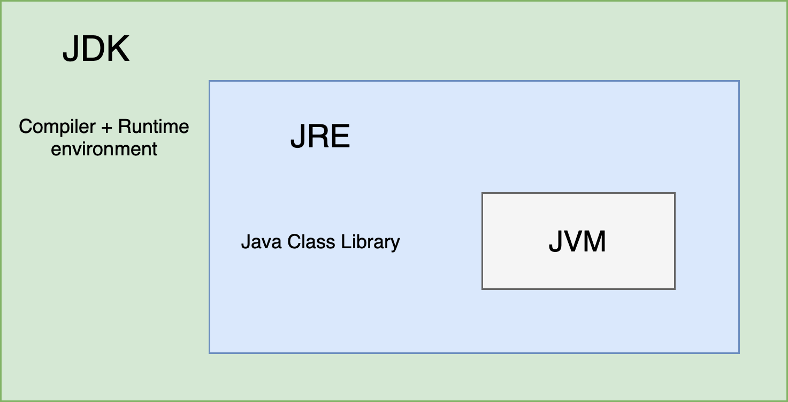
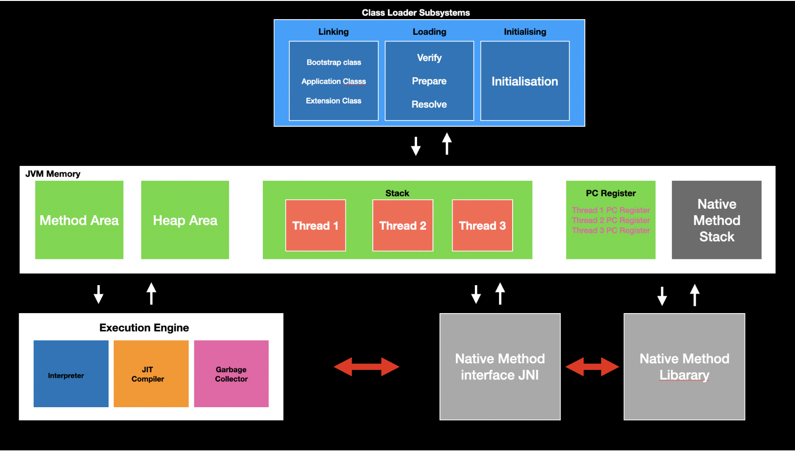
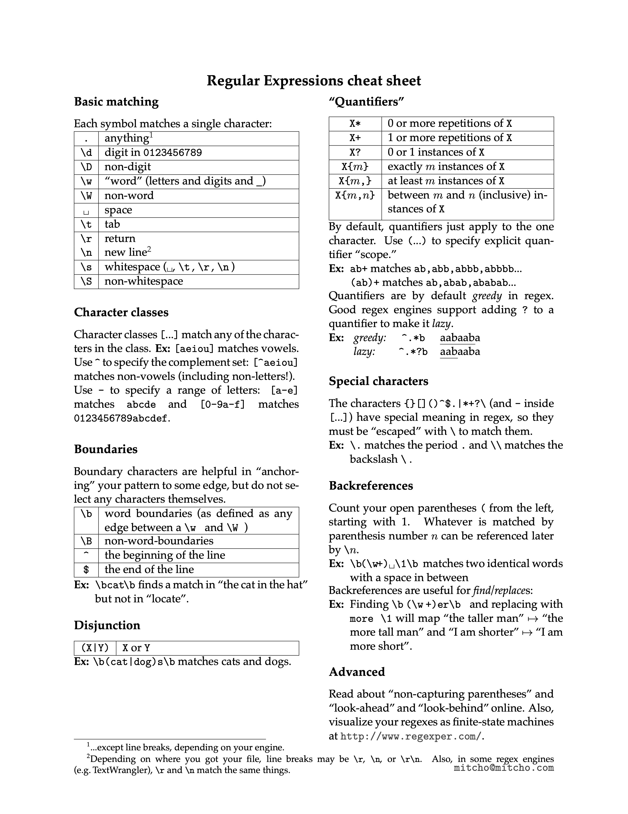
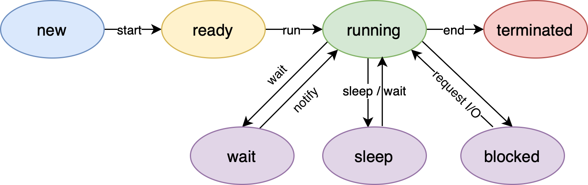
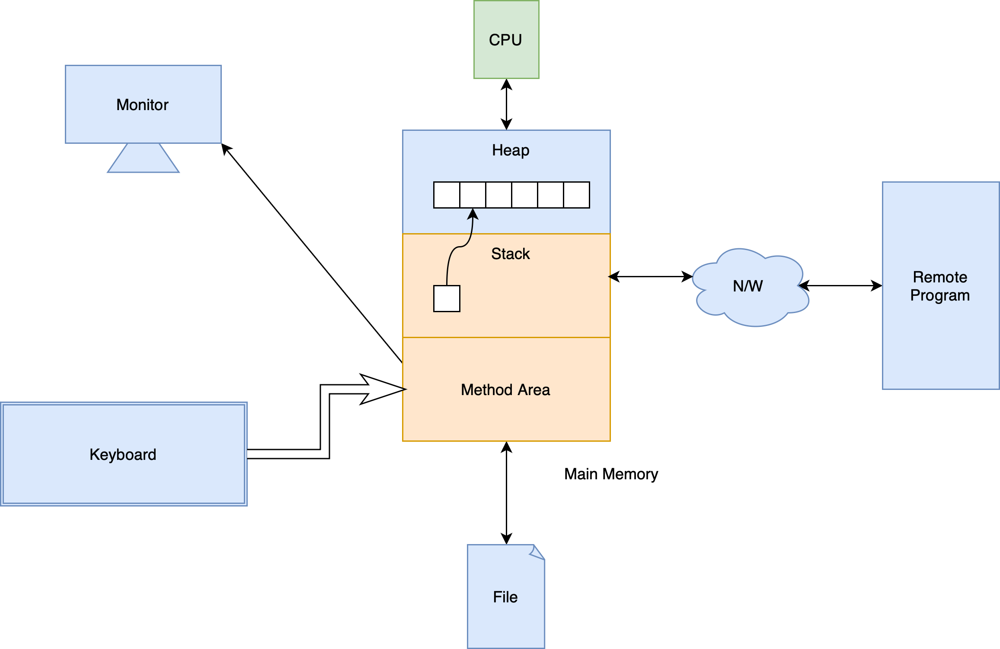
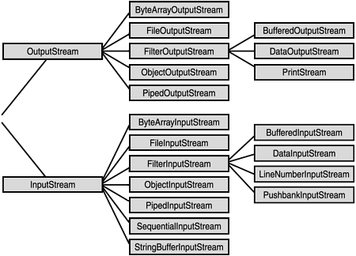
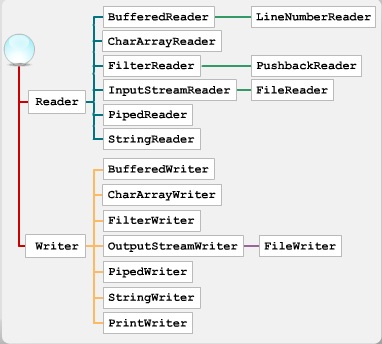
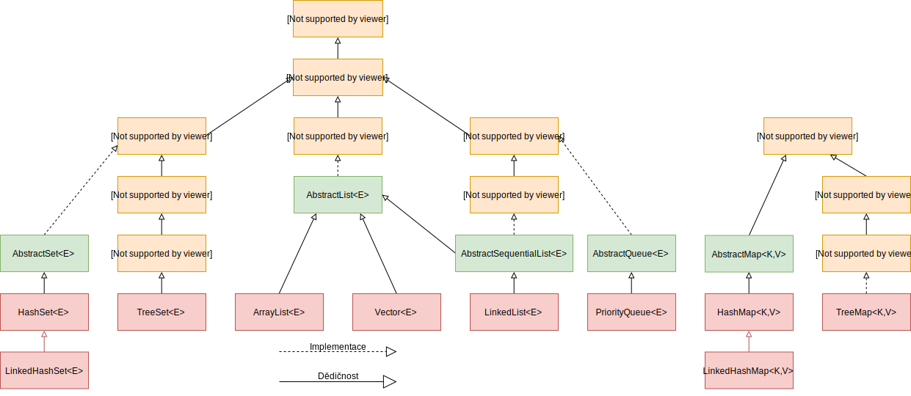
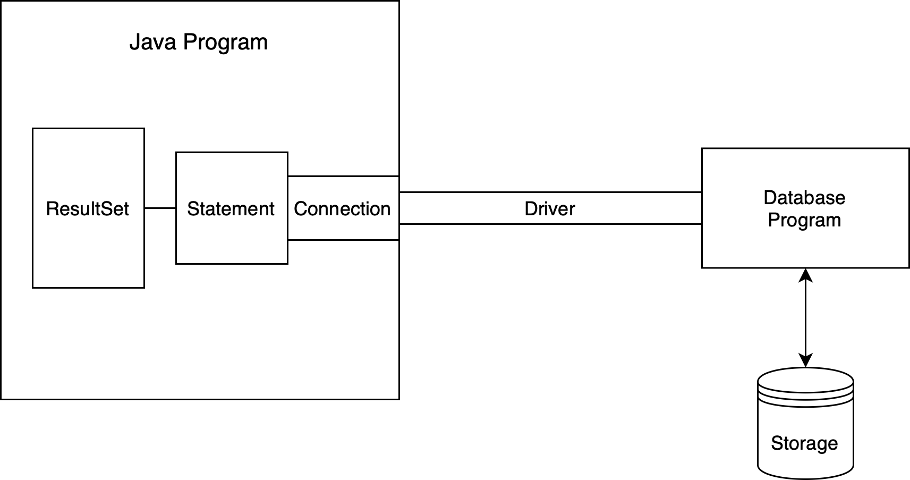

# Java Notes

***

## Introduction

* 

* JDK

  * Java development toolkit

  * Versions of JDK get released every 6 months

  * Release a LTS version every 3 years

* Java is a hybrid language

  * `javac` - compile
  * `java` - interpret

* JVM

  * Java virtual machine
  * Make Java platform independent
  * 

***

## Basic Syntax and Concepts

* Java is case-sensitive

### Variables

* Three types of variables

  * Fields - member variables in a class

  * Local variables - variables in a method or block of code

  * Parameters - variables in method declarations

    > ==NOTE==: No global variables in Java

* Data type

  * *Primitive data type*
    * `boolean`, `byte`, `short`, `int`, `long`, `float`, `double`, `char`
    * Overflow and underflow
    * `BigDecimal` class overcomes the precision issues of the floating number types
    * `char` in Java is *2 bytes* to allow you to store Unicode characters
      * e.g. `'\u0040' == 'A'`
  * *Class data type*
  * Casting
  
* Declaration and Initialisation

* Literals

  * **Good habit**: add appropriate data type suffix


### Operators

* Operator and operand
* Mathematical operators
  * Only overriding operator in Java: `+`, `+=`
    * Other data type variables will be automatically casted to a String
* Assignment operator
* Abbreviating operators
* `++`, `--`
* Relational operators
* Logical operators
* Bitwise operators
* Ternary operator
* Casting operators
* `,`
* Operator precedence

### Expressions and Statements

* Expression is formed by combining variables, literals, method return values and operators
* Statement is an executable line or code block
  * Declaration statement
  * Expression statement
    * Assignment expressions
    * `++`, `--`
    * Method calls
    * Object creation

  * Control flow statement

* Code organisation: whitespace and indentation

### Flow control

* `if-else`
* `switch`
  * `String` can be used
  * [Enhanced switch](https://nipafx.dev/java-switch/)
* `while`
* `do while`
* `for`
* `foreach`

### Method

* Function in Java

* Java method is pass-by-value

* A parameter is a variable in a method definition. When a method is called, the arguments are the data you pass into the method's parameters

* Method Overloading
  * Methods have the same name, but take a unique list of argument types
  * Overloaded methods **CANNOT** differ only by return type

* Variable Arguments

  * Variable numbers of inputs

  * ```java
    void show(int... x) {
      for (int e : x)
        System.out.println(e);
    }
    
    // All valid
    show();
    show(10);
    show(10, 20);
    show(10, 20, 30);
    int[] x = {1, 2, 3};
    show(x);
    ```

* Command-line Arguments

  * `String[] args` in `main()`


***

## String

* String is an object
* String is immutable

### Creating String

* `String str = "Hello world!";`
  * Point to an object in string pool
* Constructors
  * `String(char [])`
  * `String(byte [])`
  * `String(String)`
  * Point to an object in heap

### Common String Methods

* `int length()`
* `String toLowerCase()`
* `String toUpperCase()`
* `String trim()`
* `String substring(int begin)`
* `String substring(int begin, int end)`
  * `[begin, end)`

* `String replace(char old, char new)`
* `String replaceAll(String regex, String replacement)`
* `boolean startsWith(String s)`
* `boolean endsWith(String s)`
* `char charAt(int index)`
* `int indexOf(char c)`
* `int indexOf(String s)`
* `int lastIndexOf(char c)`
* `boolean equals(String s)`
* `boolean equalsIgnoreCase(String s)`
* `int compareTo(String s)`
  * Compares two strings lexicographically
* `boolean matches(String regex)`
* `String[] split(String regex, int limit)`
* `String[] split(String regex)`
  * This method works as if by invoking the two-argument [`split`](https://docs.oracle.com/en/java/javase/21/docs/api/java.base/java/lang/String.html#split(java.lang.String,int)) method with the given expression and a limit argument of zero
  * Trailing empty strings will therefore be discarded

* `static String String.join(CharSequence delimiter, CharSequence... elements)`
* `char[] toCharArray()`
* `static String String.valueOf(int i)`
  * Convert other data type value to a string

### Regualr Expression



### StringBuffer & StringBuilder

* `StringBuffer`
  * "Mutable String"
  * `append()`, `insert()`
  * Initially will have a size of 16 capacity
  * It is thread-safe
* `StringBuilder`
  * Basically same as `StringBuffer`
  * It is not thread-safe, but faster
  * `+, +=` is actually implemented by `StringBuidler`,  one operator creates a new `StringBuilder` object

### Printing

* ```java
  // Only take one parameter
  System.out.print()
  System.out.println()
    
  // Formatted output
  System.out.printf()
  System.out.format()
  ```

***

## Array

* Initialisation
  * `<type>[] varArr = new <type>[size];`
    * All elements will be initialized to `0`, `false`, or `null`
  * `<type>[] varArr = {element1, element2, };`
    * Must combine with the declaration
  * For loop
* Array is an object
* Array has a field `length`
* Array utilities - `Arrays`
  * `int binarySearch()`
  * `int compare()`
  * `T[] copyOf()`
  * `boolean equals()`
  * `void fill()`
  * `void sort()`
  * `String toString()`
  * `List<T> asList()`
  

***

## OOP

### Classes and Objects

* Class is the blueprint, objects are the instances of their class

* Class - fields and methods

  Object - properties and behaviors

* Constructors

  * A special method is required to create a new instance of the class
  * No return type
  * Every objects has a default constructor
  * Constructors can be overloaded, using `this` keyword to overload to avoid duplication
  * `this()` must be the first statement in the overloaded constructor body
  * If a class doesn't explicitly declare any constructor, Java compiler automatically provides a no-argument constructor. This default constructor calls the class parent's no-argument constructor, or the `Object` constructor if the class has no parent. **If the parent doesn't have no-argument constructor, compiler will reject the program.**
  * It's good to always define a default constructor

* The `getter` and `setter` can also have additional validations instead of just setting or getting the fields values

* Reference vs. Object

  * All other types which are not one of the primitive types are reference types
  * References --- pointers
  * The only operators allowed for reference type are assignment via `=` and equality comparison via `==` and `!=` (Strings can use `+`, `+=`)
  * `instance of` operator: verify that an particular object is of a certain type
    * Typically used before performing a type casting

  * `new` operator instantiates a class by allocating memory for a new object and returning a reference to that memory
  * In Java, there is no way to access an object directly, everything is done using a reference

* `static` keyword

  * Fields that have `static` modifier are called static fields or class variables
  * They are associated with the class, rather than with any object. Every instance of the class shares a class variable, which is in one fixed location in memory
  * `static` methods can't access instance methods and instance variables directly, and can't use `this` keyword
  * If a method doesn't use instance variables that method should be declared as a static method
  * Referring to static fields or methods with an object instance is not encouraged
  * `static` block: a code block that will be executed before the creation of any object of that class

* `final` keyword

  * Final variables
    * `final` means a value cannot be changed **after** initialisation at run-time
      * Blank finals -> a final field inside a class can be different from each other, and yet it remains its immutable quality

    * `static final` means compile-time constant
    
  * Final arguments
    * Inside the method you cannot change the argument
  
  * Final methods
    * Prevent the method being overridden by the subclass
    * Any private methods in a class are implicitly `final`
  
  * Final classes
    * Prevent the class from being inherited


### Reusing classes


#### Inheritance

* **"is-a"** relationship

* `extends`

* Excepting `Object`, every class has one and only direct superclass

* Inheritance chain

* A subclass inherits all the members (fields, methods, and nested classes) from its super class

* A subclass doesn't "inherit" (cannot directly access) the `private` members of its parent class

  > [A great discussion about this topic](https://www.zhihu.com/question/63183685)

* Values of the inheritance:

  * To handle the complexity of the large project
  * Keep common behaviors in one class
  * Split different behaviors into separate classes
  * Keep all of the objects in a single data structure

* `this` vs. `super`

  * `super` is used to access/call the parent class members
  * `this` is used to access/call the current class members
  * Both of them can be used anywhere in a class except static areas, any attempt to do so will lead to compile-time errors
  * `this` is commonly used with constructors and setters
  * `super` is commonly used with method overriding
  * `this()` call a constructor from another overloaded constructor in the same class
  * `super()` call a parent constructor
  * **Java compiler puts a default call to `super()` if we don't add it**, and it's always the no-argument `super` which is inserted by compiler
  * A constructor can have a call to `super()` or `this()` but never both

* Method overloading vs. method overriding

  * Method overloading means providing two or more separate methods in a class with the same name but different parameters

  * We can overload static and instance methods

  * Overloading rules

    * Methods must have the same method name
    * Methods must have different parameters
    * If methods follow the rules above then they may or may ont
      * Have different return types
      * Have different access modifiers
      * Throw different checked or unchecked exceptions

  * Method overriding means defining a method in a child class that already exists in the parent class with same signature

  * Overriding rules

    * It must have same name and same arguments

    * Return type can be a subclass of the return type in the parent class

      > Covariant return types

    * We can't override static methods only instance methods

    * Constructors and private methods cannot be overridden
    
    * Methods that are final cannot be overridden
    
    * It can't have a lower access modifier
    
    * Must not throw a new or broader checked exception

#### Composition

* **"has-a"** relationship
* Use class type variables as fields
* Consider to use composition prior to inheritance

### Encapsulation

* Separate the implementation and the interface

### Polymorphism

* Compile Time Rules
  * Compiler **ONLY** knows reference type
  * Can only look in reference type class for method
  * Outputs a method signature
* Runtime Rules

  * Follow exact **runtime type** of object to find the method
  * Must match compile time method signature to appropriate method in actual object's class

***

## Interfaces and Abstract Classes

* Interfaces and abstract classes provide a more structured way to separate interface from implementation
* Inheritance is specialisation; interface is generalisation

### Interfaces

* `implements`
* An interface is a contract of what the classes **can** do
* An abstract class taken to the extreme,thus more flexibility (complete decoupling)
* Refer to different types of objects with one identical interface type
  * Generalisation
  * Capability of putting different types of objects into one data structure
  * Less effort for code alteration
* One class can implement several interfaces
  * "Multiple inheritance": A class can be upcast to more than one base type with interfaces
* Interface cannot be instantiated
* Methods in interfaces are implicitly `public`
* Fields in interfaces are implicitly constant (`public static final`)
* Interface can have `static` methods
* An interface can extend another interface
* Interface can have `default` methods which can have method body
  * Java 8 feature
  * Make refactoring interface easier
  * Java 9 allows `private` methods in interface that can be used in `default` methods inside interface


### Abstract Classes

* An abstract class is a class that is declared `abstract`
* Contain a mix of methods with or without implementation
* An abstract method is a method that is declared `abstract` without an implementation
* Abstract class cannot be instantiated, but can be subclassed
* When an abstract class is subclassed, the subclass usually provides implementations for all of the abstract methods in its superclass. However, if it doesn't, then the subclass must also be declared `abstract`
* A subclass of a non-abstract superclass can be `abstract`

### Interfaces vs. Abstract Classes

* Abstract Classes
  * Purpose is to **provide a common definition of a base class that multiple derived classes can share**
  * Share code among several *closely* related classes
  * Expect classes that extend your abstract class to have many common methods or fields or required access modifier other than `public`
  * Want to declare non static or non final fields
  * Provide default implementations of certain methods but leave other methods open to being overridden
* Interfaces
  * Purpose is **abstraction**
  * Expect unrelated classes will implement your interface
  * Want to specify the behavior of a particular data type, but not concern about who implements its behavior
  * Want to separate different behaviors

***

## Access Control

* Package

  * A collection of classes, interfaces, or other packages
  * `package`, `import`
  * Create a library and import it
    * Extract the package to `.jar` (Java ARchive) file in the project structure
    * Import the `.jar` file into the new project libraries in the project structure

* Scope

* Naming Convention

  * Reversed url

* Access control

  * At the top level: public or package-private (no explicit modifiers)

  * At the member level: public, private, protected, or package-private

  * A class declared with `public` is visible to all classes everywhere; A class with no modifier is visible only within its package

  * | Modifier    | Class | Package | Subclass outside the package | World |
    | ----------- | ----- | ------- | ---------------------------- | ----- |
    | `public`    | Y     | Y       | Y                            | Y     |
    | `protected` | Y     | Y       | Y                            | N     |
    | no modifier | Y     | Y       | N                            | N     |
    | `private`   | Y     | N       | N                            | N     |

***

## Nested Classes

* Place a class definition within another class definition
* Nested classes are divided into two categories: non-static and static
  * Non-static nested classes are called *inner classes*
  * Nested classes that are declared `static` are called *static nested classes*

### Inner Classes

* Inside the outer class, inner class can access the members of outer class directly (even if it's `private`)

* Inside the outer class, you can create inner class objects

* If you want to make an object of the inner class anywhere except from within a non-static method of the outer class, you must specify the type of the object as `Outer.Inner`

  ```java
  // Inner class is public
  Outer outer = new Outer();
  Outer.Inner inner = outer.new Inner();
  ```

* Produce the reference to the outer class object within the inner class definition: `Outer.this`

* The inner class will be compiled to `Outer$Inner.class`

* Inner class cannot have `static` members or nested classes

### Local and Anonymous Inner Classes

* Local inner class: an inner class defined inside a code block, typically in a method
  * A local class can access local variables and parameters of the enclosing block that are final or *effectively final*

* Anonymous inner class: an inner class defined at the time of creation of itself
  * Useful when you want a class inheriting from a superclass or implementing an interface which only used in a specific method


### Static Nested Classes

* The static member of outer class

* In effect, a static nested class is behaviorally a top-level class that has been nested in another top-level class for packaging convenience

* You instantiate a static nested class the same way as a top-level class

  ```java
  StaticNestedClass staticNestedObject = new StaticNestedClass();
  ```

### Why Nested Classes?

* It is a way of logically grouping classes that are only used in one place
* It increases encapsulation
* It can lead to more readable and maintainable code
* Nature of the problem


***

## Exception Handling

### Type of Errors

* Syntax error
  * Identified by compiler
* Logical error
  * Identified by debugging
* Runtime error - Exception
  * Bad inputs
  * Unavailable resources


### `Exception` Class

* Methods

  * `String getMessage()`

  * `String toString()`

  * `void printStackTrace()`
    * Prints this throwable and its backtrace to the standard error stream

* 
  ```mermaid
  graph TD
  A[Object] --> B[Throwable]
  B --> C[Exception]
  B --> D[Error]
  C --> E[ClassNotFoundException]
  C --> F[IOException]
  C --> G[InterruptedException]
  R --> H[NumberFormatException]
  C --> R[RuntimeException]
  R --> I[ArithmeticException]
  R --> J[IndexOutOfBoundException]
  R --> K[NullPointerException]
  ```

* Checked exceptions: you must handle them *at compile time*

* Special case: `RuntimeException`

  * Unchecked exceptions: you don't have to handle them
  * They’re always **thrown automatically** by Java and you don’t need to include them in your exception specifications
  * If a `RuntimeException` gets all the way out to `main( )` **without being caught**, `printStackTrace( )` is called for that exception as the program exits; the output is reported to `System.err`

* Creating your own exceptions

  * ```java
    class MinBalanceException extends Exception {
      public String toString() {
        return "Minimal balance should be 5000. Try again!"
      }
    }
    ```

### How to Handle Exceptions

* ```java
  try {
    // logic that might generate exceptions
  } catch () {
    // handling exception if it occurs
  } finally {
    // activities happen every time even if a method is returned (executed before return)
    // cleanup
  }
  ```

* There can be zero, one, or multiple `catch` blocks

* `try catch` block can be nested

* `finally` block is necessary when you need to set something other than memory (garbage collector is responsible for releasing heap memories) back to its original state (releasing resources)

> Objects in heap are also resources, the real composition of the program are the references on stack

* Try with resources

  * Java 7 feature

  * Support multiple resources, separated by `;`

  * ```java
    try (Scanner scanner = new Scanner(new File("test.txt"))) {
        while (scanner.hasNext()) {
            System.out.println(scanner.nextLine());
        }
    } catch (FileNotFoundException fnfe) {
        fnfe.printStackTrace();
    }
    
    // no finally block
    // For objects which implement AutoClosable interface
    ```

* Java supports termination exception handling instead of resumption

* Throwing an exception

  * `throw new Exception("");`
  * Exceptions can be rethrown
    * Happen in the `catch` block
    * *Exception chaining*: Often you want to catch one exception and throw another, but still keep the information about the originating exception

> There is a pitfall in Java Exception implementation: lost exception
>
> `return` inside `finally` block

### Exception Specification

* Politely tell the client programmer what exceptions the method throws, so the client programmer can handle them
* `throws`
* Unchecked exceptions can be omitted
* The "exception specification interface" for a particular method may narrow during inheritance and overriding, but it may not widen

> [A great article by Barry Ruzek around this topic](https://www.oracle.com/technical-resources/articles/enterprise-architecture/effective-exceptions-part1.html)

***

## Multiprogramming

* Multiprogramming

  * Running more than one programs on a single computer

  * ```mermaid
    graph TD
    A[Multiprogramming] ---> B[Multi-users]
    A ---> C[Multitasking]
    C ---> D[Multithreading]
    ```

> Go read the Concurrency chapter of Thinking in Java

* By multiprogramming CPU's idle time is minimised
* A Thread of execution is the smallest sequence of programmed instructions that can be managed independently
* In many cases, a thread is a component of a process
* Useful for web server, GUI, animation, etc.

### How to Implement Multithreading

1. `extends` or `implements` or lambda expression
   * Depends on whether the subclass is inherited a superclass or not
   * `Thread` class
   * `Runnable` interface
2. Overriding the `run()` method

   * `run()` is the starting point of a thread
3. Start the thread

   * If `implements Runnable`, `Thread t = new Thread(new Object()); t.start();`
   * If `extends Thread`, `o.start();`

### `Thread` class

* States of Thread
  * 
* Thread priority
  * Scheduler in JVM maintains a thread ready queue
  * The exact behaviour depends on the JVM
* Constructors
  * `Thread()`
  * `Thread(Runnable r)`
  * `Thread(Runnable r, String name)`
  * `Thread(ThreadGroup g, String name)`
* Getter and setter
  * `long getId()`
  * `String getName()`
  * `int getPriority()`
    *  Default priority of a thread (`NORM_PRIORITY`) in Java is 5; `MIN_PRIORITY` is 1 and `MAX_PRIORITY` is 10
  * `ThreadState getState()`
  * `ThreadGroup getThreadGroup()`
  * `void setName(String name)`
  * `void setPriority(int p)`
  * `void setDaemon(boolean b)`
    * A daemon thread is the background thread with least priority
    * An example: garbage collector
* Enquiry methods
  * `boolean isAlive()`
  * `boolean isDaemon()`
  * `boolean isInterrupted()`
* Instance methods
  * `void inerrupt()`
  * `void join()`
    * Wait for this thread to die

  * `void join(long milli)`
  * `void run()`
  * `void start()`

* Static methods
  * `int activeCount()`
    * Returns an estimate of the number of active threads in the current thread's `ThreadGroup` and its subgroups

  * `Thread currentThread()`
    * Returns a reference to the currently executing thread object.

  * `void sleep(long milli)`
    * Causes the currently executing thread to sleep

  * `void yield()`
    * A hint to the scheduler that the current thread is willing to yield its current use of a processor

  * `void dumpStack()`
    * Prints a stack trace of the current thread to the standard error stream


### Synchronisation

* Shared resources
* Critical section
* Mutual exclusion
* Locking / mutex
* Semaphore
* Monitor
* Race condition
* Inter-thread communication
* How Java achieve synchronisation
  * Object monitor
  * `sychronized`
    * Guard the critical section
  * Synchronised method
  * Synchronised block
* How Java achieve ITC
  * `wait()`,  `notify()`, `notifyAll()`

***

## `Java.lang`

* A default package which will be automatically imported

### `Object`

* The root of the class hierarchy

* Every class is a subclass, direct or indirect, of the `Object` class

* [Interfaces](https://docs.oracle.com/en/java/javase/11/docs/api/java.base/java/lang/Object.html)

  * ```java
    public final native Class<?> getClass()
    public native int hashCode()
    public boolean equals(Object obj)
    protected native Object clone() throws CloneNotSupportedException
    public String toString()
    public final native void notify()
    public final native void notifyAll()
    public final native void wait(long timeout) throws InterruptedException
    public final void wait(long timeout, int nanos) throws InterruptedException
    public final void wait() throws InterruptedException
    protected void finalize() throws Throwable { }
    ```

* Override `equals()` and `hashcode()`
  * If two objects are equal according to the `equals()` method, then calling the `hashCode` method on each of the two objects must produce the same integer result
  * Default implementation of `equals()` simply tests `this == obj`
  * If logical equivalent is important, override `equals()`
  * **Principles**
    * Reflexive
    * Symmetric
    * Transitive
    * Consistent
    * For non-null reference `x`, `x.equals(null) == false`

### Wrapper Class

* Java supports primitive types using classes

* Initialisation

  * `Integer myInteger = new Integer(56);`
  * `Integer myInteger = 56;`
    * Will be converted to `Integer myInteger = Integer.valueOf(56);` at compile time
  * `int myInt = myInteger`
    * Will be converted to `int myInt = myInteger.intValue()`

* It's a good practice using `equals()` method to compare wrapper class objects

* Interfaces

  * Autoboxing --- `Integer.valueOf(int)`

  * Unboxing --- `intValue()`

  * Parsing values from a string

    ```java
    String strNum = "2048";
    int num = Integer.parseInt(strNum);
    ```

* `BigDecimal`
  * Constructor
    * `BigDecimal(String value)`
    * `BigDecimal.valueOf(double value)`
  * Methods
    * `BigDecimal add(BigDecimal val)`
    * `BigDecimal substract(BigDecimal val)`
    * `BigDecimal multiply(BigDecimal val)`
    * `BigDecimal divide(BigDecimal divisor, int scale, RoundingMode roundingMode)`
    * `int compareTo(BigDecimal val)`
      * Omit comparison on scale
      * DON'T use `equals()`

### `Math`

* All static methods

### `Enum`

* Work like a class with static final fields, each identifier is an object
* It can have a constructor but only `private` or default
* It can also have other members

### `Java.lang.reflect`

* Helpful to get information of a class

* Four ways to get a `Class` object

  * ```java
    Class alunbarClass = TargetObject.class;
    
    TargetObject o = new TargetObject();
    Class alunbarClass2 = o.getClass();
    
    // Below two will not initialise the class, 
    // static fields and static code blocks will not be executed
    Class alunbarClass1 = Class.forName("cn.javaguide.TargetObject");
    
    ClassLoader.getSystemClassLoader().loadClass("cn.javaguide.TargetObject");
    ```

* Example

  * ```java
    package cn.javaguide;
    
    public class TargetObject {
        private String value;
    
        public TargetObject() {
            value = "JavaGuide";
        }
    
        public void publicMethod(String s) {
            System.out.println("I love " + s);
        }
    
        private void privateMethod() {
            System.out.println("value is " + value);
        }
    }
    
    ```

  * ```java
    package cn.javaguide;
    
    public class Main {
        public static void main(String[] args) throws ClassNotFoundException, NoSuchMethodException, IllegalAccessException, InstantiationException, InvocationTargetException, NoSuchFieldException {
            Class<?> targetClass = Class.forName("cn.javaguide.TargetObject");
            TargetObject targetObject = (TargetObject) targetClass.newInstance();
          
            Method[] methods = targetClass.getDeclaredMethods();
            for (Method method : methods) {
                System.out.println(method.getName());
            }
    
            Method publicMethod = targetClass.getDeclaredMethod("publicMethod",
                    String.class);
            publicMethod.invoke(targetObject, "JavaGuide");
    
            Field field = targetClass.getDeclaredField("value");
            field.setAccessible(true);
            field.set(targetObject, "JavaGuide");
    
            Method privateMethod = targetClass.getDeclaredMethod("privateMethod");
            privateMethod.setAccessible(true);
            privateMethod.invoke(targetObject);
        }
    }
    ```


***

## Date and Time API

* Starting time: `1 Jan 1970`; starting year for a calendar: `1900`
* Old APIs in `java.util`
  * Keep timestamp in a `long` value in milliseconds
  * Is mutable
  * `java.util.Date` is deprecated
  * `java.util.Calendar`
    * An abstract class
    * The standard calendar: `GregorianCalendar`
  * `java.util.TimeZone`
    * An abstract class
* New APIs: Joda Date and Time APIs in `java.time`
  * Date and time are separated
  * Keep timestamp in seconds and nano seconds
  * Is **immutable**
  * `Instant`
    * A timestamp
  * `LocalDate`, `LocalTime`, `LocalDateTime`, `ZonedDateTime`, `ZoneID`
  * `Duration`, `Period`
    * A `Duration` is a simple measure of time along the time-line in nanoseconds
    * A `Period`  expresses an amount of time in units meaningful to humans, such as years or days
    * `between()`
  * `Month`, `DayOfWeek`, `Year`, `YearMonth`, `MonthDay`, `OffsetTime`, `OffsetDateTime`, `ZoneOffset`
  * Methods
    * `of` - static factory method
    * `now` - static factory method
    * `parse` - static factory method focused on parsing
    * `get` - gets the value of something
    * `is` - checks if something is true
    * `with` - the immutable equivalent of a setter
    * `plus` - adds an amount to an object
    * `minus` - subtracts an amount from an object
    * `to` - converts this object to another type
    * `at` - combines this object with another
  * All calculations should check for numeric overflow and throw either an `ArithmeticException` or a `DateTimeException`
  * `DateTimeFormatter`
    * `ofPattern(String pattern)`
    * [doc](https://docs.oracle.com/en/java/javase/21/docs/api/java.base/java/time/format/DateTimeFormatter.html)
  * `ChronoField`

***

## Lamda Expression

* Java 8 feature

* Anonymous function whose definition is not bound to an identifier

* To replace anonymous inner class

* Only works for **`FunctionalInterface`**

* ```java
  @FunctionalInterface
  interface MyLambda {
    void display(String s);
  }
  
  public class Main {
    public static void main(String[] args) {
      MyLambda m = (s) -> {
        System.out.println("Hello " + s);
      };
      m.display("David");
    }
  }
  ```

* Acting as an object

* Local variables referenced from a lambda expression must be final or effectively final (not modified)

* Instance variables can be accessed and modified

* Use cases

  * `Runnable`
  * `Comparator`
  * `Listener`
  * `Collections`

> Very similar to arrow function in JavaScript
>
> [Oracle tutorial](https://www.oracle.com/webfolder/technetwork/tutorials/obe/java/lambda-quickstart/index.html)

* Method references

  * Sometimes, a lambda expression does nothing but call an existing method. In those cases, it's often clearer to refer to the existing method by name

  * | Kind                                                         | Syntax                                 | Examples                                                     |
    | ------------------------------------------------------------ | -------------------------------------- | ------------------------------------------------------------ |
    | Reference to a static method                                 | `ContainingClass::staticMethodName`    | `Person::compareByAge` `MethodReferencesExamples::appendStrings` |
    | Reference to an instance method of a particular object       | `containingObject::instanceMethodName` | `myComparisonProvider::compareByName` `myApp::appendStrings2` |
    | Reference to an instance method of an arbitrary object of a particular type | `ContainingType::methodName`           | `String::compareToIgnoreCase` `String::concat`               |
    | Reference to a constructor                                   | `ClassName::new`                       | `HashSet::new`                                               |

***

## Java IO Streams

* 
* Stack and method area is the **context** of a program; others are the resources
* [`java.io` package hierarchy](https://docs.oracle.com/javase%2F9%2Fdocs%2Fapi%2F%2F/java/io/package-tree.html)
* [Java Stream Tutorial](https://docs.oracle.com/javase/tutorial/essential/io/index.html)

### Stream

* *Stream is a flow of data*
* An *I/O Stream* represents an input source or an output destination
* Streams support many different kinds of data, including simple bytes, primitive data types, localized characters, and objects
* Some streams simply pass on data; others manipulate and transform the data in useful ways
* The basic priciple
  * A stream is a sequence of data
  * A program uses an *input stream* to read data from a source, one item at a time
  * A program uses an *output stream* to write data to a destination, one item at time

### Byte Streams

* Handle I/O of raw binary data
* All byte stream classes are descended from `InputStream`and `OutputStream` (abstract class)
* `InputStream` methods
  * `int read()`
    * Reads the next byte of data from the input stream
    * The only abstract method
    * Returns the next byte of data, or `-1` if the end of the stream is reached
    * This method blocks until input data is available, end of file is detected, or an exception is thrown
  * `int read(byte[] b)`
    * Reads some number of bytes from the input stream and stores them into the buffer array `b`
  * `int read(byte[]b, int off, int len)`
    * Reads up to `len` bytes of data from the input stream into buffer array `b`
    * The first byte read is stored into element `b[off]`, the next one into `b[off+1]`, and so on
  * `int available()`
    * Returns an estimate of the number of bytes that can be read (or skipped over) from this input stream without blocking or `0` when it reaches the end of the input stream
  * `long skip(long n)`
    * Skips over and discards `n` bytes of data from this input stream
    * Returns the actual number of bytes skipped.
  * `void mark(int limit)`
    * Marks the current position in this input stream. A subsequent call to the `reset` method repositions this stream at the last marked position so that subsequent reads re-read the same bytes
    * **Only works for buffered streams**
  * `void reset()`
    * Repositions this stream to the position at the time the `mark` method was last called on this input stream
  * `boolean markSupported()`
    * Tests if this input stream supports the `mark` and `reset` methods
  * `void close()`
    * Closes this input stream and releases any system resources associated with the stream
* `OutputStream` methods
  * `void write(int b)`
    * Writes the specified byte to this output stream
    * The byte to be written is the eight low-order bits of the argument `b`. The 24 high-order bits of `b` are ignored
    * The only abstract method
  * `void write(byte[] b)`
    * Writes `b.length` bytes from the specified byte array to this output stream
  * `void write(byte[] b, int off, int len)`
    * Writes `len` bytes from the specified byte array starting at offset `off` to this output stream
  * `void flush()`
    * Flushes this output stream and forces any buffered output bytes to be written out
    * **Only works for buffered streams**
  * `void close()`
    * Closes this output stream and releases any system resources associated with this stream
* Hierarchy of byte streams
  * 
* `ByteArrayInputStream` and `ByteArrayOutputStream`
  * `ByteArrayInputStream(byte[] buf)`
    * Creates a `ByteArrayInputStream` so that it uses `buf` as its buffer array
  * `ByteArrayInputStream(byte[] buf, int offset, int length)`
  * `byte[] readAllBytes()`
    * Reads all remaining bytes from the input stream
  * `long transferTo(OutputStream out)`
    * Reads all bytes from this input stream and writes the bytes to the given output stream in the order that they are read
    * Returns the number of bytes transferred
  * `byte[] toByteArray()`
  * `void writeTo(OutputStream out)`
    * Writes the complete contents of this byte array output stream to the specified output stream argument
* `FileInputStream` and `FileOutputStream`

### Character Streams

* Working with that Java stores character in 2 bytes
* Character streams are often "wrappers" for byte streams
* The character stream uses the byte stream to perform the physical I/O, while the character stream handles translation between characters and bytes
* `Reader` methods
  * `long transferTo(Writer out)`
    * Reads all characters from this reader and writes the characters to the given writer in the order that they are read
  * Don't have `available()`
* `Writer` methods
  * `Writer append(char c)`
    * Appends the specified character to this writer
    * `out.append(c)` behaves exactly the same as `out.write(c)`
  * `Writer append(CharSequence csq)`
  * `Writer append(CharSequence csq, int start, int end)`
* Hierarchy of character stream
  * 
* `CharArrayReader` and `CharArrayWriter`
* `FileReader` and `FileWriter`

### Buffered Streams

* For unbuffered steams, each read or write request is handled directly by the underlying OS

* This can make a program much less efficient, since each such request often triggers disk access, network activity, or some other operation that is relatively expensive

* Buffer

  * A temporary memory object for holding the data
  * The native input and output APIs are called only when the buffer is **empty or full**
  * It often makes sense to write out a buffer at critical points, without waiting for it to fill. This is known as *flushing* the buffer

* A program can convert an unbuffered stream into a buffered stream using the *wrapping idiom*

  * ```java
    inputStream = new BufferedReader(new FileReader("xanadu.txt"));
    outputStream = new BufferedWriter(new FileWriter("characteroutput.txt"));
    ```

* `BufferedInputStream` and `BufferedOutputStream`

* `BufferedReader` and `BufferedWriter`

### Formatting Streams

* `PrintWriter`, `PrintStream`
  * The only `PrintStream` objects you are likely to need are `System.out` and `System.error`
  * When you need to create a formatted output stream, instantiate `PrintWriter`, not `PrintStream`
  * `void print()`
    * `String.valueOf()` is invoked, and then the string's characters are converted into bytes according to the default charset, and these bytes are written in exactly the manner of the `write(int)`.
  * `void println()`
  * `PrintStream printf()`, `PrintStream format()`
    * They behave the same
* `Scanner`
  * Useful for breaking down formatted input into tokens and translating individual tokens according to their data type
  * By default, a scanner uses white space (*include blanks, tabs, and line terminators*) to separate tokens
  * A scanning operation (`next()` or `hasNext()`) may block waiting for input
  * Even though a scanner is not a stream, you need to close it to indicate that you're done with its underlying stream

### Data Streams

* `DataInputStream`, `DataOutputStream`
* Created as a wrapper for an existing byte stream object
* The input stream consists of simple binary data, with nothing to indicate the type of individual values, or where they begin in the stream (not readable)
* Each specialized `write` in `DataStreams` is exactly matched by the corresponding specialized `read`. It is up to the programmer to make sure that output types and input types are matched in this way
* `DataStreams` uses one very bad programming technique: it uses floating point numbers to represent monetary values

### Object Streams

* Serialisation and deserialisation
  * Storing and retrieving the state of an object
  * Most, but not all, standard classes support serialization of their objects
  * Rules
    * **Implement the marker interface `Serializable`**
    * **There must be a non-parametarized constructor**
    * **`static` or `transient` members will not be serialised**
* `ObjectInputStream`, `ObjectOutputStream`
  * A single invocation of `writeObject()` can cause a large number of objects to be written to the stream
  * A stream can only contain one copy of an object, though it can contain any number of references to it
  * If a single object is written to two different streams, it is effectively duplicated
  * Type casting after `readObject()` is needed

### `RandomAccessFile`

* A random access file behaves like a large array of bytes stored in the file system

* There is a kind of cursor, or index into the implied array, called the *file pointer*

* Implements `DataInput` and `DataOutput`

* Constructor

  * `RandomAccessFile(File file, String mode)`

  * `RandomAccessFile(String name, String mode)`

  * | Value   | Meaning                                                      |
    | :------ | :----------------------------------------------------------- |
    | `"r"`   | Open for reading only. Invoking any of the `write` methods of the resulting object will cause an `IOException` to be thrown. |
    | `"rw"`  | Open for reading and writing. If the file does not already exist then an attempt will be made to create it. |
    | `"rws"` | Open for reading and writing, as with `"rw"`, and also require that every update to the file's content or metadata be written synchronously to the underlying storage device. |
    | `"rwd"` | Open for reading and writing, as with `"rw"`, and also require that every update to the file's content be written synchronously to the underlying storage device. |

* Methods

  * `long getFilePointer()`
    * Returns the current offset in this file
  * `void seek(long pos)`
    * Sets the file-pointer offset, measured from the beginning of this file, at which the next read or write occurs
  * `long length()`
    * Returns the length of this file, measured in bytes

### Piped Streams

* Communicate producer and consumer instead of using shared objects
* Typically, data is written to a `PipedOutputStream` object by one thread and data is read from the connected `PipedInputStream` by some other thread
* `connect()`

### File I/O

* `Path`

  * A `Path` is **NOT** system independent

  * You can think of the `Path` as storing these name elements as a sequence

  * `Paths.get(String first, String... more)`

    * Creating a `Path`

    * ```java
      Path p1 = Paths.get("/tmp/foo");
      // Paths.get() is a shorthand of
      Path p2 = FileSystems.getDefault().getPath("/tmp/foo");
      ```

  * `Path getFileName()`

  * `Path getName(int index)`

  * `int getNameCount()`

  * `Path subpath(int beginIndex, int endIndex)`

    * Not including a root element

  * `Path getParent()`

  * `Path getRoot()`

  * `URI toUri()`

  * `Path toAbsolutePath()`

    * The file does not need to exist for this method to work

  * `Path toRealPath(LinkOption... option)`

    * If `true` is passed to this method and the file system supports symbolic links, this method resolves any symbolic links in the path
    * If the `Path` is relative, it returns an absolute path
    * If the `Path` contains any redundant elements, it returns a path with those elements removed
    * This method throws an exception if the file does not exist or cannot be accessed

  * `Path resolve(Path p)`

  * `Path resolve(String s)`

    * Join two paths

  * `Path relativize(Path other)`

    * Constructs a relative path between this path and a given path

* `File`

* `Files`

***

## Generics

* One of the most significant change in Java SE5

* The concept of *parameterized types*: you tell what type you want to use, and it takes care of the details

* ```java
  // generic class or interface
  public class ClassName<T> {}
  public interface InterfaceName<A, B, C, D> {}
  
  // generic methods
  public <T> void func(T x) {}
  ```

* If you don't specify the type explicitly when declaring the instance, it will be an `Object` type

* Bounds

  * Allow you to place constraints on the parameter types that can be used with generics

  * ```java
    class A {}
    class B extends A {}
    
    // always extends whenever A is a class or an interface
    class Test<T extends A> {}
    
    public class Main {
      public static void main(String[] args) {
        // both allowed
        Test<A> t = new Test<>();
        Test<B> t = new Test<>();
      }
    }
    ```

* Wildcard

  * Type arguments of parameterized types

  * ```java
    // upper bound
    ? extends B
    // lower bound
    ? super B
    ```

  * ```java
    class Test {
        static void printCollection(Collection<?> c) {
                                    // a wildcard collection
            for (Object o : c) {
                System.out.println(o);
            }
        }
    
        public static void main(String[] args) {
            Collection<String> cs = new ArrayList<String>();
            cs.add("hello");
            cs.add("world");
            printCollection(cs);
        }
    }
    ```

  * If the type parameter is only used in method signature, in the absence of such interdependency between the type(s) of the argument(s), the return type and/or throws type, generic methods are considered bad style, and wildcards are preferred

* Java generics are implemented using *erasure*, which means that any specific type information is erased when you use a generic

  * ```java
    // This is not allowed
    T[] t = new T[size]; // compile error
    
    T[] t = (T[]) new Object[size]; // no error
    ```

* Erasure is a compromise in the implementation of Java generics, reification would be a better choice if generics had been part of Java 1.0

* [Erasure ensures migration compatibility](https://docs.oracle.com/javase/specs/jls/se8/html/jls-4.html#jls-4.7)

***

## Collections

### Java Collection Framework



### `Collection`

* Methods
  * `boolean add(E e)`
  * `boolean addAll(Collection<? extends E> c)`
  * `boolean remove(Object o)`
  * `boolean removeAll(Collection<?> c)`
  * `boolean retainAll(Collection<?> c)`
  * `boolean contains(Object o)`
  * `boolean containsAll(Collection<?> c)`
  * `void clear()`
  * `boolean isEmpty()`
  * `int size()`
  * `Iterator<E> iterator()`
  * `Object[] toArray()`
  * `T[] toArray(T[] a)`
    * `a` - the array into which the elements of this collection are to be stored, if it is big enough; otherwise, a new array of the same runtime type is allocated for this purpose
    * The element in the array immediately following the end of the collection is set to `null`

### `List`

* An ordered collection (a sequence)
* Methods
  * `void add(int index, E e)`

  * `boolean addAll(int index, Collection<? extends E> c)`

  * `E get(int index)`

  * `E remove(int index)`

  * `E set(int index, E e)`
    * Returns the element previously at the specified position

  * `int indexOf(Object o)`

  * `int lastIndexOf(Object o)`

  * `List<E> subList(int from, int to)`
    * `from` - low endpoint (inclusive) of the subList
    * `to` - high endpoint (exclusive) of the subList

  * `ListIterator<E> listIterator()`

  * `ListIterator<E> listIterator(int index)`

  * `static List<E> of(E... elements)`
    * Returns an **unmodifiable list** containing an arbitrary number of elements

  * `static List<E> copyOf(Collection<? extends E> coll)`
    * Returns an **unmodifiable list** containing the elements of the given Collection, in its iteration order
    * The given Collection must not be null, and it must not contain any null elements

* More flexible iterator: `listIterator()`

  * Can move back

    * `previous()`
      * logically equivalent to `*(p--)`

    * `hasPrevious()`


#### `ArrayList`

* Resizable-array implementation of the `List` interface
* Cannot store primitive type variables
* Copy an `ArrayList`
  * `addAll(originalArrayList)`
  * `ArrayList<E> copy = new ArrayList<>(originalArrayList)`

#### `LinkedList`

* Doubly-linked list implementation of the `List` and `Deque` interfaces
* Suitable for large list with lots of insertion and deletion

### `Queue`

* FIFO

* Methods
  * `boolean add(E e)`
    * Throws an `IllegalStateException` if no space is currently available

  * `boolean offer(E e)`
    * Returns false instead of throwing `IllegalStateException`

  * `E remove()`
    * Retrieves and removes the head of this queue, or throws `NoSuchElementException` if this queue is empty

  * `E poll()`

    * Retrieves and removes the head of this queue, or returns `null` if this queue is empty

  * `E element()`
    * Retrieves, but does not remove, the head of this queue, or throws `NoSuchElementException` if this queue is empty

  * `E peek()`

    * Retrieves, but does not remove, the head of this queue, or returns `null` if this queue is empty

  * |         | Throws exception | Returns special value |
    | ------- | ---------------- | --------------------- |
    | Insert  | `add(e)`         | `offer(e)`            |
    | Remove  | `remove()`       | `poll()`              |
    | Examine | `element()`      | `peek()`              |

#### `Deque`

* Double ended queue

* A linear collection that supports element insertion and removal at both ends

* It can be used as a queue or a stack

* Methods

  * |         | First Element (Head)                                         |                                                              | Last Element (Tail)                                          |                                                              |
    | :------ | ------------------------------------------------------------ | ------------------------------------------------------------ | ------------------------------------------------------------ | ------------------------------------------------------------ |
    |         | Throws exception                                             | Special value                                                | Throws exception                                             | Special value                                                |
    | Insert  | [`addFirst(e)`](https://docs.oracle.com/en/java/javase/21/docs/api/java.base/java/util/Deque.html#addFirst(E)) | [`offerFirst(e)`](https://docs.oracle.com/en/java/javase/21/docs/api/java.base/java/util/Deque.html#offerFirst(E)) | [`addLast(e)`](https://docs.oracle.com/en/java/javase/21/docs/api/java.base/java/util/Deque.html#addLast(E)) | [`offerLast(e)`](https://docs.oracle.com/en/java/javase/21/docs/api/java.base/java/util/Deque.html#offerLast(E)) |
    | Remove  | [`removeFirst()`](https://docs.oracle.com/en/java/javase/21/docs/api/java.base/java/util/Deque.html#removeFirst()) | [`pollFirst()`](https://docs.oracle.com/en/java/javase/21/docs/api/java.base/java/util/Deque.html#pollFirst()) | [`removeLast()`](https://docs.oracle.com/en/java/javase/21/docs/api/java.base/java/util/Deque.html#removeLast()) | [`pollLast()`](https://docs.oracle.com/en/java/javase/21/docs/api/java.base/java/util/Deque.html#pollLast()) |
    | Examine | [`getFirst()`](https://docs.oracle.com/en/java/javase/21/docs/api/java.base/java/util/Deque.html#getFirst()) | [`peekFirst()`](https://docs.oracle.com/en/java/javase/21/docs/api/java.base/java/util/Deque.html#peekFirst()) | [`getLast()`](https://docs.oracle.com/en/java/javase/21/docs/api/java.base/java/util/Deque.html#getLast()) | [`peekLast()`](https://docs.oracle.com/en/java/javase/21/docs/api/java.base/java/util/Deque.html#peekLast()) |

* Comparison of `Queue` and `Deque` methods

  * | `Queue` Method                                               | Equivalent `Deque` Method                                    |
    | ------------------------------------------------------------ | ------------------------------------------------------------ |
    | [`add(e)`](https://docs.oracle.com/en/java/javase/21/docs/api/java.base/java/util/Deque.html#add(E)) | [`addLast(e)`](https://docs.oracle.com/en/java/javase/21/docs/api/java.base/java/util/Deque.html#addLast(E)) |
    | [`offer(e)`](https://docs.oracle.com/en/java/javase/21/docs/api/java.base/java/util/Deque.html#offer(E)) | [`offerLast(e)`](https://docs.oracle.com/en/java/javase/21/docs/api/java.base/java/util/Deque.html#offerLast(E)) |
    | [`remove()`](https://docs.oracle.com/en/java/javase/21/docs/api/java.base/java/util/Deque.html#remove()) | [`removeFirst()`](https://docs.oracle.com/en/java/javase/21/docs/api/java.base/java/util/Deque.html#removeFirst()) |
    | [`poll()`](https://docs.oracle.com/en/java/javase/21/docs/api/java.base/java/util/Deque.html#poll()) | [`pollFirst()`](https://docs.oracle.com/en/java/javase/21/docs/api/java.base/java/util/Deque.html#pollFirst()) |
    | [`element()`](https://docs.oracle.com/en/java/javase/21/docs/api/java.base/java/util/Deque.html#element()) | [`getFirst()`](https://docs.oracle.com/en/java/javase/21/docs/api/java.base/java/util/Deque.html#getFirst()) |
    | [`peek()`](https://docs.oracle.com/en/java/javase/21/docs/api/java.base/java/util/Deque.html#peek()) | [`peekFirst()`](https://docs.oracle.com/en/java/javase/21/docs/api/java.base/java/util/Deque.html#peekFirst()) |

* Comparison of `Stack` and `Deque` methods

  * | Stack Method                                                 | Equivalent `Deque` Method                                    |
    | ------------------------------------------------------------ | ------------------------------------------------------------ |
    | [`push(e)`](https://docs.oracle.com/en/java/javase/21/docs/api/java.base/java/util/Deque.html#push(E)) | [`addFirst(e)`](https://docs.oracle.com/en/java/javase/21/docs/api/java.base/java/util/Deque.html#addFirst(E)) |
    | [`pop()`](https://docs.oracle.com/en/java/javase/21/docs/api/java.base/java/util/Deque.html#pop()) | [`removeFirst()`](https://docs.oracle.com/en/java/javase/21/docs/api/java.base/java/util/Deque.html#removeFirst()) |
    | [`peek()`](https://docs.oracle.com/en/java/javase/21/docs/api/java.base/java/util/Deque.html#peek()) | [`getFirst()`](https://docs.oracle.com/en/java/javase/21/docs/api/java.base/java/util/Deque.html#getFirst()) |

#### `ArrayDeque`

* Resizable-array implementation of `Deque`
* This class is likely to be faster than `Stack`when used as a stack, and faster than `LinkedList` when used as a queue
* Most `ArrayDeque` operations run in amortized constant time

#### `PriorityQueue`

* An unbounded priority queue based on a priority heap
* The elements are ordered according to their *natural ordering*, or by a `Comparator` provided at construction time

### `Set`

* A collection that contains no duplicate elements, and at most one `null` element. More formally, sets contain no pair of elements `e1` and `e2` such that `e1.equals(e2)`
* No defined ordering
* No extra methods 

#### `HashSet`

* This class implements the `Set` interface, backed by a hash table (actually a `HashMap` instance)
* `HashSet(int initialCapacity, float loadFactor)`

#### `LinkedHashSet`

* Hash table and linked list implementation of the `Set` interface, with predictable iteration order
* This linked list defines the iteration ordering, which is the order in which elements were inserted into the set (*insertion-order*)

#### `TreeSet`

* A `NavigableSet` implementation based on a `TreeMap`
* The elements are ordered according to their *natural ordering*, or by a `Comparator` provided at construction time
* This implementation provides guaranteed `log(n)` time cost for the basic operations
* Methods
  * `E ceiling(E e)`
  * `E floor(E e)`
  * `E higher(E e)`
  * `E lower(E e)`

### `Map`

* An object that maps keys to values
* Java map cannot contain duplicate keys, and each key can only map to at most one value
* Methods
  * `V put(K key, V value)`
    * Returns the previous value associated with `key`, or `null` if there was no mapping for `key`
  * `V get(Object key)` 
  * `V remove(Object key)`
  * `V replace(K key, V value)`
  * `boolean containsKey(Object key)`
  * `boolean containsValue(Object value)`
  * `Set<K> keySet()`
  * `Collection<V> values()`
  * `Set<Map.Entry<K, V>> entrySet()`
    * Those returned collections are backed by the map, so changes to the map are reflected in the set, and vice-versa

#### `HashMap`

* Hash table based implementation

#### `LinkedHashMap`

* Hash table and linked list implementation

* Insertion order or access order

* Can be implemented as cache

  * Override the method `protected boolean removeEldestEntry(Map.Entry<K, V> eldest)`

  * ```java
    private static final int MAX_ENTRIES = 100;
    
     protected boolean removeEldestEntry(Map.Entry eldest) {
        return size() > MAX_ENTRIES;
     }
    ```


#### `TreeMap`

* A red-black tree implementation

### `BitSet`

* This class implements a vector of bits that grows as needed
* Each component of the bit set has a `boolean` value
* By default, all bits in the set initially have the value `false`

### `Collections`

* `Collections` is a utility class
* It contains only `static` methods
* Methods
  * `<T extends Comparable<? super T>> void sort(List<T> l)`
  * `<T> void sort(List<T> l, Comparator<? super T> c)`
  * `void reverse(List<?> l)`
  * `void rotate(List<?> l, int distance)`
  * `void shuffle(List<?> l)`
  * `void swap(List<?> l, int i, int j)`
  * `min()`, `max()`
  * `<T> int binarySearch(List<? extends Comparable<? super T>> list, T key)`
  * `<T> int binarySearch(List<? extends T> list, T key, Comparator<? super T> c)`
    * Returns the index of the search key, if it is contained in the list; otherwise, `(-(insertion point) - 1)`

### `Iterator`

* An iterator over a collection
* Iterators allow the caller to remove elements from the underlying collection during the iteration with well-defined semantics
* Methods
  * `boolean hasNext()`

  * `E next()`

  * `void remove()`

* *fail-fast*: if the list is structurally modified at any time after the iterator is created, in any way **except through the iterator's own `remove()` or `add()` methods**, the iterator will throw a `ConcurrentModificationException`. Thus, in the face of concurrent modification, the iterator fails quickly and cleanly, rather than risking arbitrary, non-deterministic behavior at an undetermined time in the future
* *The fail-fast behavior of iterators should be used only to detect bugs*
* Iterator is implemented as a private inner class in each collection class implementation
* `ListIterator`
  * An iterator for lists that allows the programmer to traverse the list in either direction, modify the list during iteration, and obtain the iterator's current position in the list
  * A `ListIterator` has no current element; its *cursor position* always lies between the element that would be returned by a call to `previous()` and the element that would be returned by a call to `next()`

### `Comparable` and `Comparator`

* `java.lang.Comparable<T>`
  * Method
    *  `int compareTo(T o)`
      * Returns a negative integer, zero, or a positive integer as this object is less than, equal to, or greater than the specified object

  * Lists (and arrays) of objects that implement this interface can be sorted automatically by `Collections.sort` (and `Arrays.sort`). Objects that implement this interface can be used as keys in a `SortedMap` or as elements in a `SortedSet`, without the need to specify a comparator
  * **It is a functional interface but not one logically**
    * It is more like a trait of an object. "This thing can be compared", rather than "this thing does the comparing"

  * How to use `Comparable`?
    * Implement the interface

* `java.util.Comparator<T>`
  * A functional interface
    * `int compare(T o1, T o2)`

  * Comparators can be passed to a sort method (such as `Collections.sort` or `Arrays.sort`) to allow precise control over the sort order. Comparators can also be used to control the order of certain data structures (such as `SortedSet` or `SortedMap`), or to provide an ordering for collections of objects that don't have a natural ordering
  * When to use `Comparator`?
    * The objects in collections don't have natural ordering. E.g. their class is provided in an external library without write permission

    * The objects do have natural ordering but you want to sort it in a different logic

  * How to use `Comparator`?
    * Create an anonymous class implementing `Comparator` and pass it as a parameter
    * Lamda expression


### Shallow Copy vs. Deep Copy

* | Shallow Copy                                                 | Deep Copy                                                    |
  | ------------------------------------------------------------ | ------------------------------------------------------------ |
  | Shallow Copy stores the references of objects to the original memory address. | Deep copy stores copies of the object’s value.               |
  | Shallow Copy reflects changes made to the new/copied object in the original object. | Deep copy doesn’t reflect changes made to the new/copied object in the original object. |
  | Shallow Copy stores the copy of the original object and points the references to the objects. | Deep copy stores the copy of the original object and recursively copies the objects as well. |
  | Shallow copy is faster.                                      | Deep copy is comparatively slower.                           |


* Shallow copy

  ```java
  Collection<T> copy = new Collection<>(original);
  ```

* Deep copy

  * Deep copy of Java class

    * Implement the `Clonable` interface and override the `clone()` method (inherited from `Object`) in the class of objects within the collection

      > Note: `Object.clone()` is `native`
      >
      > Must implement `Cloneable` to handle `CloneNotSupportedException`, more details referring to the Javadoc in the source code

    * However, `clone()` is actually shallow copy not deep copy

    * Therefore,

      * All immutable fields or primitive fields can be used as it is. They don’t require any special treatment. e.g. primitive classes, wrapper classes and `String` class.
      * For all mutable field members, we must create a new object of member and assign it’s value to cloned object.

    * ```java
      @Override
      public Person clone() {
          try {
              Person person = (Person) super.clone();
              person.setAddress(person.getAddress().clone());
              return person;
          } catch (CloneNotSupportedException e) {
              throw new AssertionError();
          }
      }
      ```

  * Deep copy of Java Collections

    1. Create a new instance of collection
    2. Clone all elements from given collection to clone collection

  * [Example](https://howtodoinjava.com/java/collections/arraylist/arraylist-clone-deep-copy/)

### Collections to Array

* `<T> T[] toArray(T[] array)`
  * Must pass a specific type array of length 0

### Array to Collections

* `List<T> Arrays.asList(T... a)`

  * The array should be an array of object instead of an array of primitive type values

    * ```java
      int[] myArray = {1, 2, 3};
      List myList = Arrays.asList(myArray);
      System.out.println(myList.size());// 1
      System.out.println(myList.get(0));// address of that array
      System.out.println(myList.get(1));// ArrayIndexOutOfBoundsException
      int[] array = (int[]) myList.get(0);
      System.out.println(array[0]);// 1
      ```

  * The returned list implements the optional `Collection` methods, except those that would change the size of the returned list. Those methods leave the list unchanged and throw `UnsupportedOperationException`

    * No `add()`, `remove()`, `clear()`

* How to correctly transform an array to a list

  1. `List list = new ArrayList<>(Arrays.asList("a", "b", "c"))`

  2. ```java
     Integer [] myArray = { 1, 2, 3 };
     List myList = Arrays.stream(myArray).collect(Collectors.toList());
     // Also works for primitive array
     int [] myArray2 = { 1, 2, 3 };
     List myList = Arrays.stream(myArray2).boxed().collect(Collectors.toList());
     ```

  3. `List.of(array)`
     * Unmodifiable list


***

## Networking Programming

* `Socket`, `ServerSocket`
* A socket is one endpoint of a two-way communication link between two programs running on the network
* `DatagramSocket`, `DatagramPacket`

***

## JDBC

* JDBC is an API used in java programming to interact with databases
* Java Database Connectivity
* 

### JDBC Drivers

* Establish connection

* Convert data types from Java language to database data types

* Type-1 driver

  * JDBC-ODBC bridge
  * Open Database Connectivity (ODBC) is an open standard API that allows application programmers to access any database
  * A layer between different program languages and different database systems
  * Partial driver (not fully written in Java)

* Type-2 driver

  * Native-API
  * API sitting on the database system
  * Partial

* Type-3 driver

  * Java-Net protocol driver
  * Use a server to talk to database
  * Pure

* Type-4 driver

  * Thin driver
  * Direct driver written in Java
  * Pure

* ```java
  import java.sql.Connection;
  import java.sql.DriverManager;
  import java.sql.ResultSet;
  import java.sql.SQLException;
  import java.sql.Statement;
  
  public class Sample
  {
    public static void main(String[] args)
    {
      // NOTE: Connection and Statement are AutoClosable.
      //       Don't forget to close them both in order to avoid leaks.
      try
      (
        // create a database connection
        Connection connection = DriverManager.getConnection("jdbc:sqlite:sample.db");
        Statement statement = connection.createStatement();
      )
      {
        statement.setQueryTimeout(30);  // set timeout to 30 sec.
  
        statement.executeUpdate("drop table if exists person");
        statement.executeUpdate("create table person (id integer, name string)");
        statement.executeUpdate("insert into person values(1, 'leo')");
        statement.executeUpdate("insert into person values(2, 'yui')");
        ResultSet rs = statement.executeQuery("select * from person");
        while(rs.next())
        {
          // read the result set
          System.out.println("name = " + rs.getString("name"));
          System.out.println("id = " + rs.getInt("id"));
        }
      }
      catch(SQLException e)
      {
        // if the error message is "out of memory",
        // it probably means no database file is found
        e.printStackTrace(System.err);
      }
    }
  }
  ```

* 

***

## JavaDoc

* Tags
  * Class
    * `@author`
    * `@version`
    * `@since`
    * `@see`
  * Method
    * `@param`
    * `@return`
    * `@throws`
    * `@exception`
    * `@deprecated`
    * `@code`
  * Others
    * `@link`
    * `@value`
    * `@serial`

***

## Annotations

* Annotations provide information (*metadata*) that you need to fully describe your program to the compiler and JVM, but that cannot be expressed in Java

* Java 5 feature

* In fact, annotation is a special interface which extends `Annotation` interface

* Built-in annotations

  * Annotates the code
    * `@Override`
    * `@Deprecated`
      * Methods can still be used
    * `@SuppressWarnings()`
      * To turn off inappropriate compiler warnings
    * `@SafeVarargs`
      * Useful for variable arguments
      * Method must be `private` or `final`
    * `@FunctionalInterface`
      * Describe an interface that has only one method
  * Annotates the annotation
    * `@Retention(RetentionPolicy.CLASS)`
      * Indicates how long annotations with the annotated type are to be retained
    * `@Documented`
      * Provides support to JavaDoc
    * `@Target`
      * Indicates the target of the annotation
    * `@Inherited`
      * Indicates the annocation can be used on subclasses
    * `@Repeatable`
      * Indicates the annotation can be used multiple times

* User-defined annotations

  * ```java
    @interface MyAnno {
      String name();
      String date();
      String version() default "1.0";
    }
    
    @MyAnno(name="David", date="01/01/1970")
    public MyClass {}
    ```

***

## Reference 

* Thinking in Java, Bruce Eckel
* [CLearningPath notes](https://github.com/hadjShell/CLearningPath)