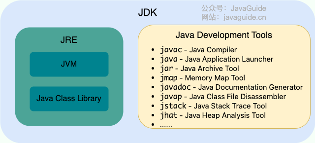

# Java Notes

***

## Introduction

* 

* JDK

  * Java development toolkit

  * Versions of JDK get released every 6 months

  * Release a LTS version every 3 years

* Java is a hybrid language

  * `javac` - compile
  * `java` - interpret

* JVM

  * Java virtual machine
  * Make Java platform independent
  * 

***

## Basic Syntax and Concepts

* Java is case-sensitive

### Variables

* Three types of variables

  * Fields - member variables in a class

  * Local variables - variables in a method or block of code

  * Parameters - variables in method declarations

    > ==NOTE==: No global variables in Java

* Data type

  * **Primitive data type**
    * `boolean`, `byte`, `short`, `int`, `long`, `float`, `double`, `char`
    * Overflow and underflow
    * `BigDecimal` class overcomes the precision issues of the floating number types
    * `char` in Java is *2 bytes* to allow you to store Unicode characters
      * e.g. `'\u0040' == 'A'`
  * **Class data type**
    * Wrapper class
      *  Java use Wrapper class for all eight primitive types
    * String
  * Casting

* Declaration and Initialisation

* Literals

  * **Good habit**: add appropriate data type suffix


### Operators

* Operator and operand
* Mathematical operators
  * Only overriding operator in Java: `+`, `+=`
    * Other data type variables will be automatically casted to a String
* Assignment operator
* Abbreviating operators
* `++`, `--`
* Relational operators
* Logical operators
* Bitwise operators
* Ternary operator
* Casting operators
* `,`
* Operator precedence

### Expressions and Statements

* Expression is formed by combining variables, literals, method return values and operators
* Statement is an executable line or code block
  * Declaration statement
  * Expression statement
    * Assignment expressions
    * `++`, `--`
    * Method calls
    * Object creation

  * Control flow statement

* Code organisation: whitespace and indentation

### Flow control

* `if-else`
* `switch`
  * `String` can be used
* `while`
* `do while`
* `for`
* `foreach`

### Method

* Function in Java

* Java method is pass-by-value

* Method Overloading
  * Methods have the same name, but take a unique list of argument types
  * Overloaded methods **CANNOT** differ only by return type

* Variable Arguments

  * Variable numbers of inputs

  * ```java
    void show(int... x) {
      for (int e : x)
        System.out.println(e);
    }
    
    // All valid
    show();
    show(10);
    show(10, 20);
    show(10, 20, 30);
    int[] x = {1, 2, 3};
    show(x);
    ```

* Command-line Arguments

  * `String[] args` in `main()`


***

## String

* String is an object
* String is immutable

### Creating String

* `String str = "Hello world!";`
  * Point to an object in string pool
* Constructors
  * `String(char [])`
  * `String(byte [])`
  * `String(String)`
  * Point to an object in heap

### Common String Methods

* `int length()`
* `String toLowerCase()`
* `String toUpperCase()`
* `String trim()`
* `String substring(int begin)`
* `String substring(int begin, int end)`
* `String replace(char old, char new)`
* `String replaceAll(String regex, String replacement)`
* `boolean startsWith(String s)`
* `boolean endsWith(String s)`
* `char charAt(int index)`
* `int indexOf(char c)`
* `int indexOf(String s)`
* `int lastIndexOf(char c)`
* `boolean equals(String s)`
* `boolean equalsIgnoreCase(String s)`
* `int compareTo(String s)`
  * Compares two strings lexicographically
* `String[] split(String regex)`
* `String String.join(CharSequence delimiter, CharSequence... elements)`
* `char[] toCharArray()`
* `String String.valueOf(int i)`
  * Convert other data type value to a string

### Regualr Expression


### StringBuffer & StringBuilder

* `StringBuffer`
  * "Mutable String"
  * `append()`, `insert()`
  * Initially will have a size of 16 capacity
  * It is thread-safe
* `StringBuilder`
  * Basically same as `StringBuffer`
  * It is not thread-safe, but faster

### Printing

* ```java
  // Only take one parameter
  System.out.print()
  System.out.println()
    
  // Formatted output
  System.out.printf()
  System.out.format()
  ```

***

## Array

* Initialisation
  * `<type>[] varArr = new <type>[size];`
    * All elements will be initialized to `0`, `false`, or `null`
  * `<type>[] varArr = {element1, element2, };`
    * Must combine with the declaration
  * For loop
* Array is an object
* Array has a field `length`
* Arrays utilities - `Arrays`
  * `Arrays.copyOf(<type>[], int)`
  * `Arrays.toString()`
  * `Arrays.asList(T[] array)`

***

## OOP

### Classes and Objects

* Class is the blueprint, objects are the instances of their class

* Class - fields and methods

  Object - properties and behaviors

* Constructors

  * A special method is required to create a new instance of the class
  * No return type
  * Every objects has a default constructor
  * Constructors can be overloaded, using `this` keyword to overload to avoid duplication
  * `this()` must be the first statement in constructor body
  * If a class doesn't explicitly declare any constructor, Java compiler automatically provides a no-argument constructor. This default constructor calls the class parent's no-argument constructor, or the `Object` constructor if the class has no parent. **If the parent doesn't have no-argument constructor, compiler will reject the program.**
  * It's good to always define a default constructor

* The `getter` and `setter` can also have additional validations instead of just setting or getting the fields values

* Reference vs. Object

  * All other types which are not one of the primitive types are reference types
  * References --- pointers
  * The only operators allowed for reference type are assignment via `=` and equality comparison via `==` and `!=` (Strings can use `+`, `+=`)
  * `instance of` operator: verify that an particular object is of a certain type
    * Typically used before performing a type casting

  * `new` operator instantiates a class by allocating memory for a new object and returning a reference to that memory
  * In Java, there is no way to access an object directly, everything is done using a reference

* `static` keyword

  * Fields that have `static` modifier are called static fields or class variables
  * They are associated with the class, rather than with any object. Every instance of the class stares a class variable, which is in one fixed location in memory
  * `static` methods can't access instance methods and instance variables directly, and can't use `this` keyword
  * If a method doesn't use instance variables that method should be declared as a static method
  * Referring to static fields or methods with an object instance is not encouraged

* `final` keyword

  * Final data
    * `final` means a value cannot be changed **after** initialisation at run-time
      * Blank finals -> a final field inside a class can be different from each other, and yet it remains its immutable quality

    * `static final` means compile-time constant
      * static initializers

  * Final arguments
    * Inside the method you cannot change the argument

  * Final methods
    * Prevent the method being overridden by the subclass
    * Any private methods in a class are implicitly `final`

  * Final classes
    * Prevent the class from being inherited


### Reusing classes


#### Inheritance

* **"is-a"** relationship

* `extends`

* Excepting `Object`, every class has one and only direct superclass

* Inheritance chain

* A subclass inherits all the members (fields, methods, and nested classes) from its super class

* A subclass doesn't "inherit" (cannot directly access) the `private` members of its parent class

  > [A great discussion about this topic](https://www.zhihu.com/question/63183685)

* Values of the inheritance:

  * To handle the complexity of the large project
  * Keep common behaviors in one class
  * Split different behaviors into separate classes
  * Keep all of the objects in a single data structure

* `this` vs. `super`

  * `super` is used to access/call the parent class members
  * `this` is used to access/call the current class members
  * Both of them can be used anywhere in a class except static areas, any attempt to do so will lead to compile-time errors
  * `this` is commonly used with constructors and setters
  * `super` is commonly used with method overriding
  * `this()` call a constructor from another overloaded constructor in the same class
  * `super()` call a parent constructor
  * Java compiler puts a default call to `super()` if we don't add it, and it's always the no-argument `super` which is inserted by compiler
  * A constructor can have a call to `super()` or `this()` but never both

* Method overloading vs. method overriding

  * Method overloading means providing two or more separate methods in a class with the same name but different parameters

  * We can overload static and instance methods

  * Overloading rules

    * Methods must have the same method name
    * Methods must have different parameters
    * If methods follow the rules above then they may or may ont
      * Have different return types
      * Have different access modifiers
      * Throw different checked or unchecked exceptions

  * Method overriding means defining a method in a child class that already exists in the parent class with same signature

  * Overriding rules

    * It must have same name and same arguments

    * Return type can be a subclass of the return type in the parent class

      > Covariant return types

    * We can't override static methods only instance methods

    * Constructors and private methods cannot be overridden
    
    * Methods that are final cannot be overridden
    
    * It can't have a lower access modifier
    
    * Must not throw a new or broader checked exception

#### Composition

* **"has-a"** relationship
* Use class type variables as fields
* Consider to use composition prior to inheritance

### Encapsulation

* Separate the implementation and the interface

### Polymorphism

* Compile Time Rules
  * Compiler **ONLY** knows reference type
  * Can only look in reference type class for method
  * Outputs a method signature
* Runtime Rules

  * Follow exact **runtime type** of object to find the method
  * Must match compile time method signature to appropriate method in actual object's class

### `Object`

* The root of the class hierarchy
* Every class is a subclass, direct or indirect, of the `Object` class
* [Interfaces](https://docs.oracle.com/en/java/javase/11/docs/api/java.base/java/lang/Object.html)
* Override `equals()` and `hashcode()`
  * If two objects are equal according to the `equals(Object)` method, then calling the `hashCode` method on each of the two objects must produce the same integer result
  * Default implementation of `equals()` simply tests `this.object == obj`
  * If logical equivalent is important, override `equals()`
  * **Principles**
    * Reflexive
    * Symmetric
    * Transitive
    * Consistent
    * For non-null `x`, `x.equals(null) == false`
  * When sub-classing, think about whether to use `instanceof` or `getClass()`

***

## Interfaces and Abstract Classes

* Interfaces and abstract classes provide a more structured way to separate interface from implementation
* Inheritance is specialisation; interface is generalisation

### Interfaces

* `implements`
* An interface is a contract of what the classes **can** do
* An abstract class taken to the extreme,thus more flexibility (complete decoupling)
* Refer to different types of objects with one identical interface type
  * Generalisation
  * Capability of putting different types of objects into one data structure
  * Less effort for code alteration
* One class can implement several interfaces
  * "Multiple inheritance": A class can be upcast to more than one base type with interfaces
* Interface cannot be instantiated
* Methods in interfaces are implicitly `public`
* Fields in interfaces are implicitly constant (`public static final`)
* Interface can have static methods
* An interface can extend another interface
* Interface can have `default` methods which can have method body
  * Java 8 feature
  * Make refactoring interface easier
  * Java 9 allows `private` methods in interface that can be used in `default` methods inside interface


### Abstract Classes

* An abstract class is a class that is declared `abstract`
* Contain a mix of methods with or without implementation
* An abstract method is a method that is declared `abstract` without an implementation
* Abstract class cannot be instantiated, but can be subclassed
* When an abstract class is subclassed, the subclass usually provides implementations for all of the abstract methods in its superclass. However, if it doesn't, then the subclass must also be declared `abstract`
* A subclass of a non-abstract superclass can be abstract

### Interfaces vs. Abstract Classes

* Abstract Classes
  * Purpose is to **provide a common definition of a base class that multiple derived classes can share**
  * Share code among several closely related classes
  * Expect classes that extend your abstract class to have many common methods or fields or required access modifier other than `public`
  * Want to declare non static or non final fields
  * Provide default implementations of certain methods but leave other methods open to being overridden
* Interfaces
  * Purpose is **abstraction**
  * Expect unrelated classes will implement your interface
  * Want to specify the behavior of a particular data type, but not concern about who implements its behavior
  * Want to separate different behavior

***

## Access Control

* Package

  * A collection of classes, interfaces, or other packages
  * `package`, `import`
  * Create a library and import it
    * Extract the package to `.jar` (Java ARchive) file in the project structure
    * Import the `.jar` file into the new project libraries in the project structure

* Scope

* Naming Convention

  * Reversed url

* Access control

  * At the top level: public or package-private (no explicit modifiers)

  * At the member level: public, private, protected, or package-private

  * A class declared with `public` is visible to all classes everywhere; A class with no modifier is visible only within its package

  * | Modifier    | Class | Package | Subclass outside the package | World |
    | ----------- | ----- | ------- | ---------------------------- | ----- |
    | `public`    | Y     | Y       | Y                            | Y     |
    | `protected` | Y     | Y       | Y                            | N     |
    | no modifier | Y     | Y       | N                            | N     |
    | `private`   | Y     | N       | N                            | N     |

***

## Inner Class

* Place a class definition within another class definition


### Nested Inner Class

* Inside the outer class, inner class can access the members of outer class directly

* Inside the outer class, you can create inner class objects

* If you want to make an object of the inner class anywhere except from within a non-static method of the outer class, you must specify the type of the object as `Outer.Inner`

  ```java
  // Inner class is public
  Outer outer = new Outer();
  Outer.Inner inner = outer.new Inner();
  ```

* Produce the reference to the outer class object within the inner class definition: `Outer.this`

* The inner class will be compiled to `Outer$Inner.class`

* Ordinary inner class cannot have `static` members or nested classes

### Local and Anonymous Inner Class

* Local inner class: an inner class defined inside a method
* Anonymous inner class: an inner class defined at the time of creation of itself
  * Useful when you want a class inheriting from a superclass or implementing an interface which only used in a specific method


### Static Inner Class

* The static member of outer class

### Why Inner Class?

* *Each inner class can independently inherit from an implementation. Thus, the inner class is not limited by whether the outer class is already inheriting from an implementation* (multiple implementation inheritance)
* The inner class can have multiple instances, each with its own state information that is independent of the information in the outer-class object
* In a single outer class you can have several inner classes, each of which implements the same interface or inherits from the same class in a different way
* Nature of the problem


***

## Generics

* One of the most significant change in Java SE5

* The concept of *parameterized types*: you tell what type you want to use, and it takes care of the details

* ```java
  // generic class or interface
  public class ClassName<T> {}
  public interface InterfaceName<A, B, C, D> {}
  
  // generic method
  public <T> void func(T x) {}
  ```

* Java generics are implemented using *erasure*, which means that any specific type information is erased when you use a generic

* Erasure is a compromise in the implementation of Java generics, reification would be a better choice if generics had been part of Java 1.0

* Erasure ensures migration compatibility

* Bounds

  * Allow you to place constraints on the parameter types that can be used with generics

  * ```java
    public class ClassName<T extends BoundedClass> {}
    ```

***

## Collections

### Java Collections Framework


### Iterator

* Implementation details in source code

* The iterators returned by the class's [`iterator`](https://docs.oracle.com/en/java/javase/11/docs/api/java.base/java/util/ArrayList.html#iterator()) and [`listIterator`](https://docs.oracle.com/en/java/javase/11/docs/api/java.base/java/util/ArrayList.html#listIterator(int)) methods are *fail-fast*: if the list is structurally modified at any time after the iterator is created, in any way **except through the iterator's own [`remove`](https://docs.oracle.com/en/java/javase/11/docs/api/java.base/java/util/ListIterator.html#remove()) or [`add`](https://docs.oracle.com/en/java/javase/11/docs/api/java.base/java/util/ListIterator.html#add(E)) methods**, the iterator will throw a [`ConcurrentModificationException`](https://docs.oracle.com/en/java/javase/11/docs/api/java.base/java/util/ConcurrentModificationException.html). Thus, in the face of concurrent modification, the iterator fails quickly and cleanly, rather than risking arbitrary, non-deterministic behavior at an undetermined time in the future

* *The fail-fast behavior of iterators should be used only to detect bugs*

* Usage

  ```java
  Iterator<E> i = collection.iterator();
  while(i.hasNext())
      System.out.println(i.next());
  ```

> ```java
> // next() logically equivalent to *p++
> public boolean hasNext() {	return cursor != size; }
> ```

* Iterator is implemented as a private inner class in each collection class implementation

### Collection

* The root interface in the *collection hierarchy*
* The JDK does not provide any direct implementations of this interface: it provides implementations of more specific sub-interfaces like Set and List. This interface is typically used to pass collections around and manipulate them where maximum generality is desired

### Collections

* Collections is a utility class
* It defines several utility methods that operate on or return collections.
* It contains only `static` methods
* Some useful methods
  * `sort()`
  * `reverse()`
  * `shuffle()`
  * `min()`, `max()`
  * `binarySearch()`
  * `swap()`
* For `getter`, `setter` and `constructor`, it is better to use a **copy** of the collection parameter to initialize the object field to ensure immutability

### Shallow Copy vs. Deep Copy

* | Shallow Copy                                                 | Deep Copy                                                    |
  | ------------------------------------------------------------ | ------------------------------------------------------------ |
  | Shallow Copy stores the references of objects to the original memory address. | Deep copy stores copies of the object’s value.               |
  | Shallow Copy reflects changes made to the new/copied object in the original object. | Deep copy doesn’t reflect changes made to the new/copied object in the original object. |
  | Shallow Copy stores the copy of the original object and points the references to the objects. | Deep copy stores the copy of the original object and recursively copies the objects as well. |
  | Shallow copy is faster.                                      | Deep copy is comparatively slower.                           |

* Usage

  * Shallow copy

    ```java
    Collection<T> copy = new Collection<>(original);
    ```

  * Deep copy

    * Deep copy of Java class

      * Implement the `clonable` interface and override the `clone()` method (inherited from `Object`) in the class of objects within the collection

        > Note: `Object.clone()` is `native`
        >
        > Must implement `cloneable` to handle `CloneNotSupportedException`, more details referring to the Javadoc in the source code

      * However, `clone()` is actually shallow copy not deep copy

      * Therefore,

        * All immutable fields or primitive fields can be used as it is. They don’t require any special treatment. e.g. primitive classes, wrapper classes and `String` class.
        * For all mutable field members, we must create a new object of member and assign it’s value to cloned object.

    * Deep copy of Java Collections

      1. Create a new instance of collection
      2. Clone all elements from given collection to clone collection

    * [Example](https://howtodoinjava.com/java/collections/arraylist/arraylist-clone-deep-copy/)

### Comparable and Comparator

* Comparison is a common behavior

* `Comparable` is an Interface with one interface `int compareTo(T o)`

* This interface imposes a total ordering on the objects of each class that implements it. This ordering is referred to as the class's **natural ordering**, and the class's `compareTo` method is referred to as its natural comparison method

* Lists (and arrays) of objects that implement this interface can be sorted automatically by `Collections.sort` (and `Arrays.sort`). Objects that implement this interface can be used as keys in a sorted map or as elements in a sorted set, without the need to specify a comparator

* How to use `Comparable`?

  * Implement the interface in the object class

* `Comparator` is a functional Interface with two interfaces: `int compare(T o1, T o2)`, `boolean equals(Object obj)`

  * Note that it is always safe **not** to override `Object.equals(Object)`. However, overriding this method may, in some cases, improve performance by allowing programs to determine that two distinct comparators impose the same order.

* Comparators can be passed to a sort method (such as `Collections.sort` or `Arrays.sort`) to allow precise control over the sort order. Comparators can also be used to control the order of certain data structures (such as sorted sets or sorted maps), or to provide an ordering for collections of objects that don't have a natural ordering

* When to use `Comparator`?

  * The objects in collections don't have natural ordering. E.g. their class is provided in an external library without write permission

  * The objects do have natural ordering but you want to sort it in a different logic

    > **Parameter can also be treated as a logic**

* How to use `Comparator`?

  * Create an anonymous class implementing `Comparator` and pass it to the `sort`

* Two types of `sort`

  * ```java
    public static <T extends Comparable<? super T>> void sort(List<T> list) {
            list.sort(null);
        }
    ```

  * ```java
    public static <T> void sort(List<T> list, Comparator<? super T> c) {
            list.sort(c);
        }
    ```

* [Extra explanation](https://www.youtube.com/watch?v=oAp4GYprVHM)

* Inconsistency with equals issue

### List

* An ordered collection (a sequence)

* More flexible iterator: `listIterator()`

  * Can move back

    * `previous()`

      > `previous() logically equivalent to *(p--)`

    * `hasPrevious()`

      ```java
      public boolean hasPrevious() {	return cursor != 0; }
      ```

  * **Use a `boolean` variable `goForward` to guard your operations**

    > As the implementations of `next()` and `previous()` are slightly logically different

  * After `remove()` the element, should move the `cursor` by `next()` or `previous` (with validation), otherwise two continuous `remove()` will throw `IllegalStateException` (because `lastRet` is set to `-1` after a `remove()` operation, see the source code for details)

#### ArrayList

* Resizable-array implementation of the `List` interface
* Cannot store primitive type variables
* [Interfaces](https://docs.oracle.com/en/java/javase/11/docs/api/java.base/java/util/ArrayList.html)
  * `add(E)` --- Append the element to the end of the list
  * `add(int, E)` --- Inserts the specified element at the specified position in this list
  * `size()`
  * `get(int)` --- Returns the element at the specified position in this list
  * `set(int, E)` --- Replaces the element at the specified position in this list with the specified element
  * `remove(int)` --- Removes the element at the specified position
  * `contains(Object)` --- Returns `true` if this list contains the specified element
  * `indexOf(Object)` --- Returns the index of the first occurrence of the specified element in this list, or -1 if this list does not contain the element
  * Copy an `ArrayList`
    * `addAll(Collection)` --- Appends all of the elements in the specified collection to the end of this list, in the order that they are returned by the specified collection's Iterator
    * `ArrayList<E> copy = new ArrayList<E>(originalArrayList)`
  * `toArray(T[])` --- Returns an array containing all of the elements in this list in proper sequence (from first to last element); the runtime type of the returned array is that of the specified array
    * With no argument, it will return a `Object` array

#### LinkedList

* Doubly-linked list implementation of the `List` and `Deque` interfaces
* Suitable for large list with lots of insertion and deletion
* [Interfaces](https://docs.oracle.com/en/java/javase/11/docs/api/java.base/java/util/LinkedList.html)
  * `getFirst()` --- Returns the first element in this list
  * `getLast()` --- Returns the last element in this list

### Queue

### Set

* A collection that contains no duplicate elements, and at most one `null` element. More formally, sets contain no pair of elements `e1` and `e2` such that `e1.equals(e2)`. No defined ordering
* [Interfaces](https://docs.oracle.com/en/java/javase/11/docs/api/java.base/java/util/Set.html)
  * `add(E e)`
  * `remove(Object o)`
  * `contains(Object o)`
  * `size()`
  * `isEmpty()`
  * `addAll(Collection<? extends E> c)` --- Union
  * `retainAll(Collection<? extends E> c)` --- Intersection
  * `removeAll(Collection<? extends E> c)` --- Difference
  * `containsAll(Collection<? extends E> c)` --- Is it a subset?
* It is recommended to override the `equals` and `hashcode` if you store mutable objects in the set

#### HashSet

* This class implements the `Set` interface, backed by a hash table (actually a `HashMap` instance)
* It makes no guarantees as to the iteration order of the set; in particular, it does not guarantee that the order will remain constant over time

#### LinkedHashSet

* Hash table and linked list implementation of the `Set` interface, with predictable iteration order
* This linked list defines the iteration ordering, which is the order in which elements were inserted into the set (*insertion-order*)

#### TreeSet

* 

### Map

* An object that maps keys to values
* Java map cannot contain duplicate keys, and each key can only map to at most one value
* Great care must be exercised if mutable objects are used as map keys. The behavior of a map is not specified if the value of an object is changed in a manner that affects `equals` comparisons while the object is a key in the map. 
* [Interfaces](https://docs.oracle.com/en/java/javase/12/docs/api/java.base/java/util/Map.html)
  * `put(K key, V value)` --- Associates the specified value with the specified key in this map. Returns: the previous value associated with `key`, or `null` if there was no mapping for `key`.
  * `get(Object key)` --- Returns the value to which the specified key is mapped, or `null` if this map contains no mapping for the key.
  * `containsKey(Object key)` --- Returns `true` if this map contains a mapping for the specified key.
  * `keySet()` --- Returns a `Set` view of the keys contained in this map.
  * `remove(Object key)` --- Removes the mapping for a key from this map if it is present. Returns the value to which this map previously associated the key, or `null` if the map contained no mapping for the key.
  * `remove(Object key, Object value)` --- Removes the entry for the specified key only if it is currently mapped to the specified value. Returns `true` if the value was removed.
  * `replace(K key, V value)` --- Replaces the entry for the specified key only if it is currently mapped to some value. Returns the previous value associated with the specified key, or `null` if there was no mapping for the key.
  * `replace(K key, V oldValue, V newValue)` --- Replaces the entry for the specified key only if currently mapped to the specified value. Returns `true` if the value was replaced.

#### HashMap

* Hash table based implementation of the `Map` interface
* This class makes no guarantees as to the order of the map; in particular, it does not guarantee that the order will remain constant over time

#### LinkedHashMap

* Hash table and linked list implementation of the `Map` interface
* Insertion order

#### TreeMap

* 


***

## Wrapper Class

* Java supports primitive types using classes

* Initialisation

  * `Integer myInteger = new Integer(56);`
  * `Integer myInteger = 56;`
    * Will be converted to `Integer myInteger = Integer.valueOf(56);` at compile time
  * `int myInt = myInteger`
    * Will be converted to `int myInt = myInteger.intValue()`
  
* Interfaces

  * Autoboxing --- `Integer.valueOf(int)`

  * Unboxing --- `intValue()`

  * Parsing values from a string

    ```java
    String strNum = "2048";
    int num = Integer.parseInt(strNum);
    ```


***

## Debugging and Unit Testing

* 

***

## Reference 

* Thinking in Java, Bruce Eckel
* [CLearningPath notes](https://github.com/hadjShell/CLearningPath)